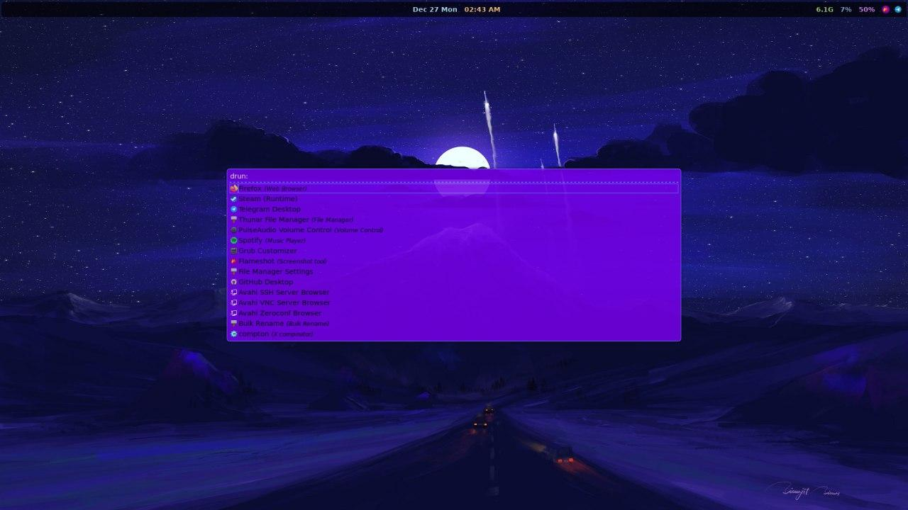
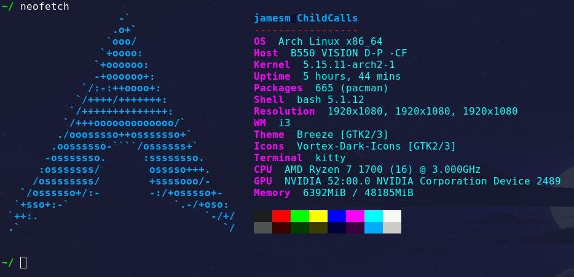

# ArchConfig
My arch i3 config files as of December 27 2021
Includes configs for I3, Rofi, Polybar, Neofetch, Kitty, and Picom

# Images

**Polybar, Rofi, and Wallpaper**

**Neofetch, and Kitty**

# Packages
Make sure to install yay before installing packages

`yay -S i3-gaps rofi kitty neofetch picom`

# Install
Just replace current files with downloaded files
